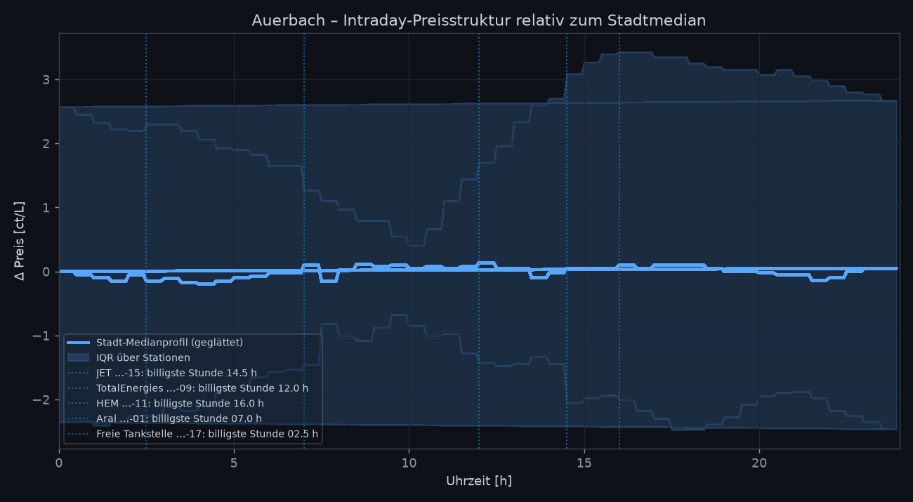
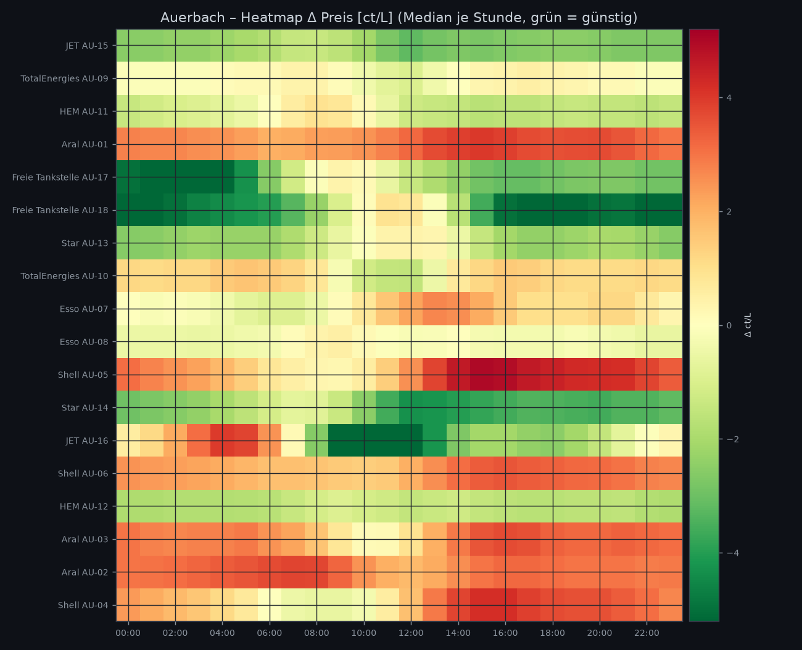
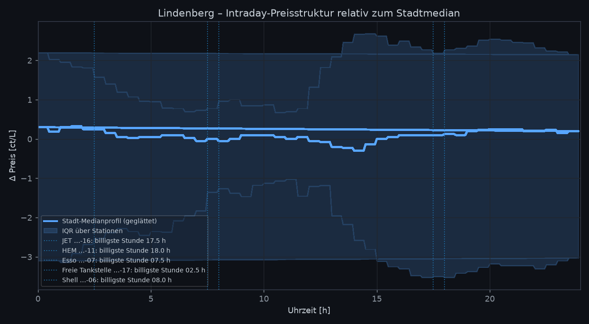
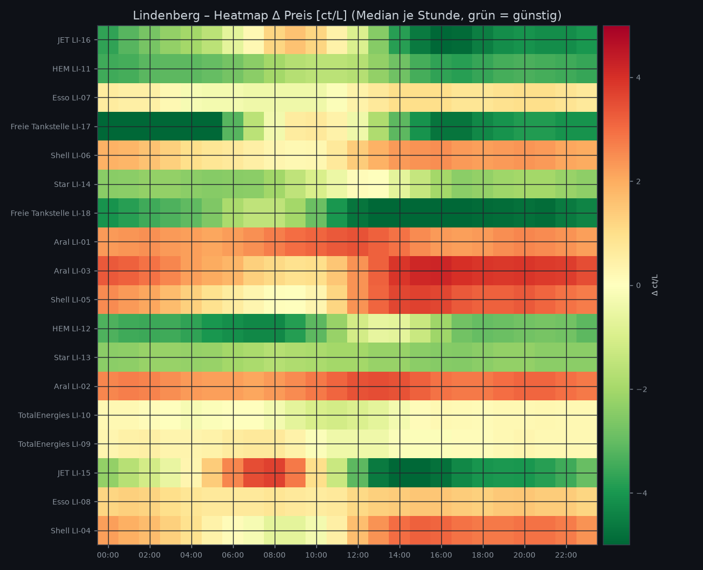
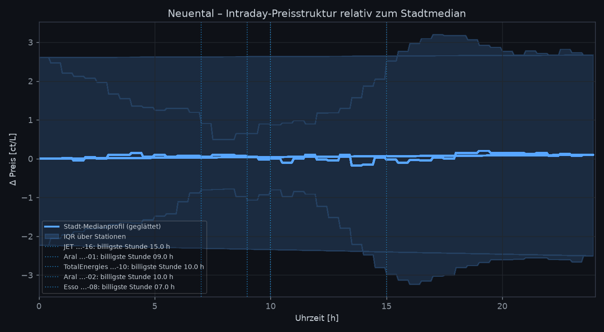
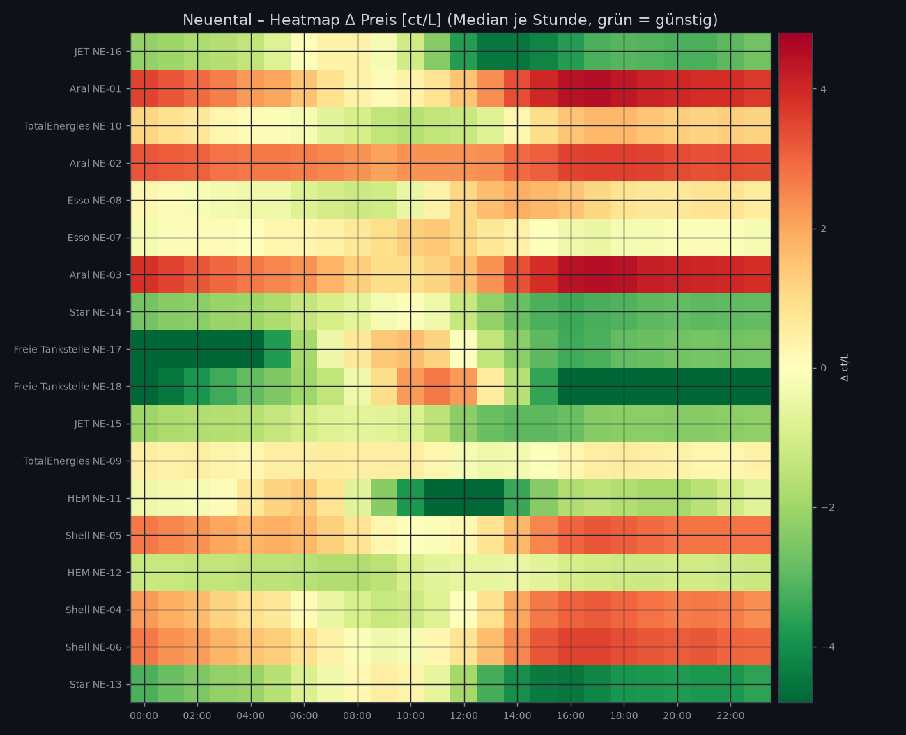
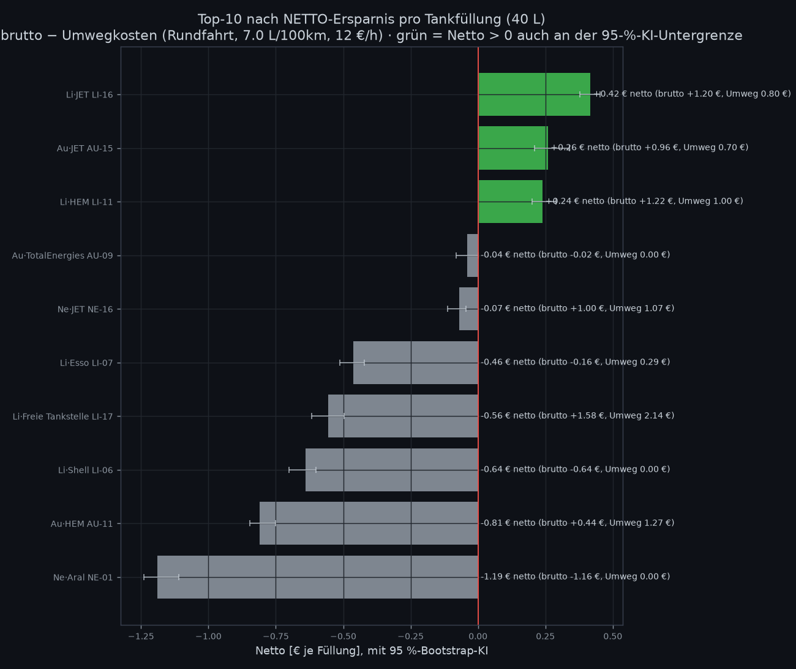

# TankApp – Tankstellen-Selektion (E10)

Automatisch erzeugt durch `analysis/station_selection.py`.

**Parameter:** Top-N = 10, Tankvolumen = 40 L, Füllungen/Woche = 1.2, Bootstrap B = 2000, Coverage-Gate ≥ 85%, FDR-Schwelle q < 0.05, Ranking nach **net**.

**Umweg-Modell `onroute`:** K = d·(c/100)·p + (d/v)·z mit d = 2·1.3×Mehrentfernung ggü. nächster Station (ohnehin unterwegs), c = 7.0 L/100km, v = 50 km/h, z = 12 €/h; p = Stadtmedian. *Netto = −δ̂·V/100 − K* mit Bootstrap-Verteilung → P(Gewinn > 0) und konservatives Lohnt-sich-Flag (KI-Untergrenze > 0). Hinweis: `--trip-mode dedicated` beantwortet die strengere Frage „lohnt eine Extrafahrt?“ — dort ist der Zeitwert meist dominant.

## Methodik in Kürze

| # | Komponente | Methode | Gewicht |
|---|---|---|---|
| 1 | Relative Preislage δ̂ | Median(p_i − LOO-Stadtmedian), Tages-Block-Bootstrap 95 %-KI | 0.4 |
| 2 | Signifikanz | einseitiger Bootstrap-p, Benjamini-Hochberg-FDR | Gate/Flag |
| 3 | Verfügbarkeit AV | P(Top-3 \| Stunde) × Pendlerprofil | 0.25 |
| 4 | Zyklus-Vorhersagbarkeit | robuste harmonische Regression (Huber), R² | 0.15 |
| − | Volatilität σ | 1.4826·MAD | 0.1 |
| − | Rangstabilität | Std(tägliche Mittelränge) | 0.1 |
| 7 | Umweg-Netto | K(d)-Modell, Bootstrap-KI, P(Netto > 0) | Ranking 'net' |

## Stadt: Auerbach

Split-Half-Stabilität der Rangfolge (Spearman-ρ δ̂ 1. vs. 2. Jahreshälfte): **ρ = 1.00** (gegen Winner's Curse; ≥ 0.8 = stabil)

| Rang | Station | Marke | δ̂ [ct/L] | 95 %-KI | q | AV | billigste Std | R² | σ [ct] | Entf. [km] | Umweg € | **Netto €/Füll** | Netto €/Jahr |
|---:|---|---|---:|---|---:|---:|---|---:|---:|---:|---:|---:|---:|
| 1 | JET Auerbach Bahnhofstraße | JET | -2.40 | [-2.60, -2.28] | 0.0010 ✅ | 0.39 | 14:30 | 0.84 | 0.74 | 2.1 | 0.70 | **+0.26** | +16.2 |
| 2 | TotalEnergies Auerbach Bahnhofstraße | TotalEnergies | +0.05 | [+0.00, +0.20] | 1.0000 | 0.00 | 12:00 | 0.70 | 0.52 | 1.3 | 0.00 | **-0.04** | -2.5 |
| 3 | HEM Auerbach Bahnhofstraße | HEM | -1.10 | [-1.29, -1.05] | 0.0010 ✅ | 0.00 | 16:00 | 0.93 | 0.74 | 2.7 | 1.27 | **-0.81** | -50.6 |
| 4 | Aral Auerbach Südring | Aral | +3.00 | [+2.90, +3.10] | 1.0000 | 0.00 | 07:00 | 0.97 | 0.89 | 2.1 | 0.68 | **-1.88** | -117.4 |
| 5 | Freie Tankstelle Auerbach Industrieweg | Freie Tankstelle | -2.80 | [-2.87, -2.70] | 0.0010 ✅ | 0.58 | 02:30 | 0.97 | 1.63 | 5.3 | 3.65 | **-2.53** | -158.1 |
| 6 | Freie Tankstelle Auerbach Ringstraße | Freie Tankstelle | -4.40 | [-4.60, -4.37] | 0.0010 ✅ | 0.93 | 19:00 | 0.94 | 1.63 | 6.2 | 4.45 | **-2.69** | -167.7 |
| 7 | Star Auerbach Berliner Allee | Star | -2.00 | [-2.12, -1.90] | 0.0010 ✅ | 0.31 | 04:00 | 0.92 | 0.89 | 5.5 | 3.89 | **-3.09** | -192.8 |
| 8 | TotalEnergies Auerbach Industrieweg | TotalEnergies | +1.00 | [+0.91, +1.10] | 1.0000 | 0.01 | 11:30 | 0.83 | 0.89 | 5.1 | 3.44 | **-3.84** | -239.8 |
| 9 | Esso Auerbach Industrieweg | Esso | +0.60 | [+0.53, +0.76] | 1.0000 | 0.01 | 06:00 | 0.93 | 1.33 | 5.3 | 3.66 | **-3.90** | -243.6 |
| 10 | Esso Auerbach Hauptstraße | Esso | -0.25 | [-0.35, -0.20] | 0.0010 ✅ | 0.00 | 01:30 | 0.80 | 0.67 | 5.7 | 4.01 | **-3.91** | -243.8 |
| 11 | Shell Auerbach Berliner Allee | Shell | +3.00 | [+2.80, +3.10] | 1.0000 | 0.00 | 08:00 | 0.98 | 2.00 | 4.9 | 3.29 | **-4.49** | -280.2 |
| 12 | Star Auerbach Am Kreuzberg | Star | -3.00 | [-3.20, -2.92] | 0.0010 ✅ | 0.61 | 14:30 | 0.91 | 1.19 | 7.6 | 5.79 | **-4.55** | -284.2 |
| 13 | JET Auerbach Industrieweg | JET | -1.50 | [-1.72, -1.50] | 0.0010 ✅ | 0.22 | 11:30 | 0.93 | 3.11 | 7.8 | 5.93 | **-5.30** | -330.9 |
| 14 | Shell Auerbach Bahnhofstraße | Shell | +2.40 | [+2.30, +2.60] | 1.0000 | 0.00 | 09:00 | 0.96 | 0.89 | 6.5 | 4.77 | **-5.73** | -357.3 |
| 15 | HEM Auerbach Hauptstraße | HEM | -1.60 | [-1.70, -1.46] | 0.0010 ✅ | 0.12 | 02:00 | 0.82 | 0.59 | 10.7 | 8.63 | **-7.99** | -498.6 |
| 16 | Aral Auerbach Industrieweg | Aral | +2.80 | [+2.65, +2.92] | 1.0000 | 0.00 | 10:30 | 0.88 | 0.89 | 8.9 | 6.95 | **-8.05** | -502.3 |
| 17 | Aral Auerbach Hauptstraße | Aral | +3.00 | [+2.97, +3.12] | 1.0000 | 0.00 | 12:30 | 0.78 | 0.74 | 9.4 | 7.40 | **-8.64** | -538.8 |
| 18 | Shell Auerbach Wiesenweg | Shell | +2.30 | [+2.20, +2.40] | 1.0000 | 0.01 | 08:00 | 0.98 | 1.93 | 10.3 | 8.24 | **-9.16** | -571.5 |

## Stadt: Lindenberg

Split-Half-Stabilität der Rangfolge (Spearman-ρ δ̂ 1. vs. 2. Jahreshälfte): **ρ = 1.00** (gegen Winner's Curse; ≥ 0.8 = stabil)

| Rang | Station | Marke | δ̂ [ct/L] | 95 %-KI | q | AV | billigste Std | R² | σ [ct] | Entf. [km] | Umweg € | **Netto €/Füll** | Netto €/Jahr |
|---:|---|---|---:|---|---:|---:|---|---:|---:|---:|---:|---:|---:|
| 1 | JET Lindenberg Wiesenweg | JET | -3.00 | [-3.13, -2.94] | 0.0011 ✅ | 0.49 | 17:30 | 0.97 | 2.22 | 2.5 | 0.80 | **+0.42** | +26.0 |
| 2 | HEM Lindenberg Hauptstraße | HEM | -3.05 | [-3.23, -3.00] | 0.0011 ✅ | 0.37 | 18:00 | 0.94 | 0.82 | 2.8 | 1.00 | **+0.24** | +14.9 |
| 3 | Esso Lindenberg Berliner Allee | Esso | +0.40 | [+0.32, +0.55] | 1.0000 | 0.00 | 07:30 | 0.96 | 0.82 | 2.0 | 0.29 | **-0.46** | -28.9 |
| 4 | Freie Tankstelle Lindenberg Ringstraße | Freie Tankstelle | -3.95 | [-4.10, -3.80] | 0.0011 ✅ | 0.56 | 02:30 | 0.99 | 2.59 | 4.0 | 2.14 | **-0.56** | -34.7 |
| 5 | Shell Lindenberg Ringstraße | Shell | +1.60 | [+1.50, +1.75] | 1.0000 | 0.00 | 08:00 | 0.96 | 1.04 | 1.7 | 0.00 | **-0.64** | -39.9 |
| 6 | Star Lindenberg Bahnhofstraße | Star | -2.00 | [-2.10, -2.00] | 0.0011 ✅ | 0.23 | 05:00 | 0.87 | 0.89 | 4.3 | 2.44 | **-1.61** | -100.2 |
| 7 | Freie Tankstelle Lindenberg Bahnhofstraße | Freie Tankstelle | -4.20 | [-4.30, -4.15] | 0.0011 ✅ | 0.66 | 15:30 | 0.96 | 1.33 | 5.8 | 3.76 | **-2.05** | -128.1 |
| 8 | Aral Lindenberg Ringstraße | Aral | +2.55 | [+2.41, +2.66] | 1.0000 | 0.00 | 04:30 | 0.88 | 0.67 | 2.9 | 1.12 | **-2.14** | -133.7 |
| 9 | Aral Lindenberg Wiesenweg | Aral | +3.00 | [+2.90, +3.20] | 1.0000 | 0.00 | 08:30 | 0.97 | 1.41 | 2.8 | 1.01 | **-2.25** | -140.5 |
| 10 | Shell Lindenberg Berliner Allee | Shell | +2.40 | [+2.20, +2.52] | 1.0000 | 0.00 | 08:00 | 0.97 | 1.56 | 3.2 | 1.35 | **-2.32** | -144.5 |
| 11 | HEM Lindenberg Bahnhofstraße | HEM | -3.10 | [-3.15, -2.90] | 0.0011 ✅ | 0.43 | 06:30 | 0.88 | 1.04 | 5.7 | 3.72 | **-2.48** | -154.5 |
| 12 | Star Lindenberg Industrieweg | Star | -2.20 | [-2.35, -2.11] | 0.0011 ✅ | 0.14 | 17:00 | 0.89 | 0.59 | 5.4 | 3.43 | **-2.53** | -157.9 |
| 13 | Aral Lindenberg Bahnhofstraße | Aral | +2.80 | [+2.70, +2.90] | 1.0000 | 0.00 | 06:00 | 0.88 | 0.74 | 3.7 | 1.84 | **-2.92** | -182.1 |
| 14 | TotalEnergies Lindenberg Wiesenweg | TotalEnergies | -0.10 | [-0.20, +0.00] | 0.1549 | 0.00 | 11:00 | 0.85 | 0.74 | 5.7 | 3.69 | **-3.65** | -227.6 |
| 15 | TotalEnergies Lindenberg Industrieweg | TotalEnergies | +0.20 | [+0.10, +0.32] | 1.0000 | 0.00 | 13:30 | 0.78 | 0.74 | 6.6 | 4.49 | **-4.57** | -285.2 |
| 16 | JET Lindenberg Südring | JET | -2.50 | [-2.64, -2.40] | 0.0011 ✅ | 0.31 | 15:30 | 0.97 | 2.89 | 8.0 | 5.76 | **-4.75** | -296.4 |
| 17 | Esso Lindenberg Bahnhofstraße | Esso | +1.10 | [+1.05, +1.20] | 1.0000 | 0.00 | 08:00 | 0.87 | 0.74 | 7.6 | 5.44 | **-5.88** | -367.2 |
| 18 | Shell Lindenberg Bahnhofstraße | Shell | +1.90 | [+1.84, +2.15] | 1.0000 | 0.00 | 08:00 | 0.97 | 1.63 | 9.6 | 7.23 | **-8.04** | -501.7 |

## Stadt: Neuental

Split-Half-Stabilität der Rangfolge (Spearman-ρ δ̂ 1. vs. 2. Jahreshälfte): **ρ = 0.99** (gegen Winner's Curse; ≥ 0.8 = stabil)

| Rang | Station | Marke | δ̂ [ct/L] | 95 %-KI | q | AV | billigste Std | R² | σ [ct] | Entf. [km] | Umweg € | **Netto €/Füll** | Netto €/Jahr |
|---:|---|---|---:|---|---:|---:|---|---:|---:|---:|---:|---:|---:|
| 1 | JET Neuental Bahnhofstraße | JET | -2.50 | [-2.58, -2.40] | 0.0011 ✅ | 0.33 | 15:00 | 0.93 | 1.63 | 1.6 | 1.07 | **-0.07** | -4.3 |
| 2 | Aral Neuental Industrieweg | Aral | +2.90 | [+2.78, +3.10] | 1.0000 | 0.00 | 09:00 | 0.99 | 1.78 | 0.4 | 0.00 | **-1.19** | -74.3 |
| 3 | TotalEnergies Neuental Wiesenweg | TotalEnergies | +0.45 | [+0.40, +0.65] | 1.0000 | 0.10 | 10:00 | 0.97 | 1.41 | 2.6 | 2.00 | **-2.17** | -135.6 |
| 4 | Aral Neuental Berliner Allee | Aral | +2.90 | [+2.75, +3.01] | 1.0000 | 0.00 | 10:00 | 0.96 | 0.74 | 1.9 | 1.43 | **-2.59** | -161.6 |
| 5 | Esso Neuental Ringstraße 41 | Esso | +0.35 | [+0.24, +0.45] | 1.0000 | 0.15 | 07:00 | 0.93 | 1.26 | 3.7 | 3.09 | **-3.21** | -200.5 |
| 6 | Esso Neuental Hauptstraße | Esso | +0.20 | [+0.10, +0.30] | 1.0000 | 0.00 | 18:30 | 0.90 | 0.74 | 4.1 | 3.37 | **-3.45** | -215.5 |
| 7 | Aral Neuental Südring | Aral | +3.20 | [+3.14, +3.30] | 1.0000 | 0.00 | 09:30 | 0.98 | 1.48 | 3.1 | 2.54 | **-3.83** | -238.8 |
| 8 | Star Neuental Industrieweg | Star | -2.30 | [-2.41, -2.21] | 0.0011 ✅ | 0.36 | 17:30 | 0.95 | 1.19 | 5.9 | 5.10 | **-4.17** | -260.1 |
| 9 | Freie Tankstelle Neuental Ringstraße | Freie Tankstelle | -2.70 | [-2.77, -2.60] | 0.0011 ✅ | 0.33 | 02:30 | 0.99 | 2.22 | 6.1 | 5.29 | **-4.21** | -263.0 |
| 10 | Freie Tankstelle Neuental Berliner Allee | Freie Tankstelle | -3.40 | [-3.53, -3.30] | 0.0011 ✅ | 0.79 | 19:00 | 0.96 | 2.67 | 6.8 | 5.88 | **-4.51** | -281.3 |
| 11 | JET Neuental Industrieweg | JET | -2.00 | [-2.10, -1.87] | 0.0011 ✅ | 0.08 | 15:30 | 0.92 | 0.89 | 6.5 | 5.65 | **-4.86** | -303.1 |
| 12 | TotalEnergies Neuental Ringstraße | TotalEnergies | +0.30 | [+0.20, +0.40] | 1.0000 | 0.00 | 13:30 | 0.63 | 0.59 | 5.8 | 5.03 | **-5.16** | -322.0 |
| 13 | HEM Neuental Ringstraße | HEM | -1.30 | [-1.44, -1.20] | 0.0011 ✅ | 0.10 | 12:30 | 0.91 | 1.78 | 6.7 | 5.80 | **-5.25** | -327.4 |
| 14 | Shell Neuental Südring | Shell | +2.10 | [+2.06, +2.25] | 1.0000 | 0.00 | 10:30 | 0.95 | 1.19 | 5.7 | 4.88 | **-5.75** | -358.6 |
| 15 | HEM Neuental Bahnhofstraße | HEM | -1.20 | [-1.30, -1.10] | 0.0011 ✅ | 0.31 | 06:00 | 0.89 | 0.59 | 8.3 | 7.30 | **-6.82** | -425.7 |
| 16 | Shell Neuental Industrieweg | Shell | +1.70 | [+1.60, +1.80] | 1.0000 | 0.07 | 09:00 | 0.98 | 1.63 | 7.1 | 6.20 | **-6.87** | -428.7 |
| 17 | Shell Neuental Am Kreuzberg | Shell | +2.15 | [+2.00, +2.23] | 1.0000 | 0.01 | 09:00 | 0.98 | 1.56 | 7.7 | 6.78 | **-7.64** | -476.8 |
| 18 | Star Neuental Bahnhofstraße | Star | -2.90 | [-3.00, -2.77] | 0.0011 ✅ | 0.60 | 17:00 | 0.95 | 1.63 | 10.1 | 8.94 | **-7.78** | -485.4 |

## 🏆 Globale Top-10 (über alle Städte, Ranking: net)

| # | Stadt | Station | Marke | δ̂ [ct/L] | q | Entf. [km] | Umweg € | Netto €/Füll | P(Gewinn>0) | lohnt? | Maps |
|---:|---|---|---:|---:|---:|---:|---:|---:|---|---|
| 1 | Lindenberg | JET Lindenberg Wiesenweg | JET | -3.00 | 0.0011 | 2.5 | 0.80 | **+0.42 €** | 100% | ✅ | [Route](https://www.google.com/maps/dir/?api=1&destination=51.368964,12.376098) |
| 2 | Auerbach | JET Auerbach Bahnhofstraße | JET | -2.40 | 0.0010 | 2.1 | 0.70 | **+0.26 €** | 100% | ✅ | [Route](https://www.google.com/maps/dir/?api=1&destination=52.415171,12.982342) |
| 3 | Lindenberg | HEM Lindenberg Hauptstraße | HEM | -3.05 | 0.0011 | 2.8 | 1.00 | **+0.24 €** | 100% | ✅ | [Route](https://www.google.com/maps/dir/?api=1&destination=51.369814,12.368667) |
| 4 | Auerbach | TotalEnergies Auerbach Bahnhofstraße | TotalEnergies | +0.05 | 1.0000 | 1.3 | 0.00 | **-0.04 €** | 1% | ⚠️ | [Route](https://www.google.com/maps/dir/?api=1&destination=52.412248,12.998371) |
| 5 | Neuental | JET Neuental Bahnhofstraße | JET | -2.50 | 0.0011 | 1.6 | 1.07 | **-0.07 €** | 0% | ⚠️ | [Route](https://www.google.com/maps/dir/?api=1&destination=51.003337,11.000386) |
| 6 | Lindenberg | Esso Lindenberg Berliner Allee | Esso | +0.40 | 1.0000 | 2.0 | 0.29 | **-0.46 €** | 0% | ⚠️ | [Route](https://www.google.com/maps/dir/?api=1&destination=51.349421,12.353699) |
| 7 | Lindenberg | Freie Tankstelle Lindenberg Ringstraße | Freie Tankstelle | -3.95 | 0.0011 | 4.0 | 2.14 | **-0.56 €** | 0% | ⚠️ | [Route](https://www.google.com/maps/dir/?api=1&destination=51.373348,12.343735) |
| 8 | Lindenberg | Shell Lindenberg Ringstraße | Shell | +1.60 | 1.0000 | 1.7 | 0.00 | **-0.64 €** | 0% | ⚠️ | [Route](https://www.google.com/maps/dir/?api=1&destination=51.347947,12.406) |
| 9 | Auerbach | HEM Auerbach Bahnhofstraße | HEM | -1.10 | 0.0010 | 2.7 | 1.27 | **-0.81 €** | 0% | ⚠️ | [Route](https://www.google.com/maps/dir/?api=1&destination=52.38468,12.971653) |
| 10 | Neuental | Aral Neuental Industrieweg | Aral | +2.90 | 1.0000 | 0.4 | 0.00 | **-1.19 €** | 0% | ⚠️ | [Route](https://www.google.com/maps/dir/?api=1&destination=50.990032,11.018426) |

## Interpretation & Caveats

- **δ̂ < 0** heißt: Station liegt median **unter** dem Stadtmedian der übrigen Stationen → strukturell günstig. Nur Stationen mit **q < 0.05** gelten als nachweisbar günstiger (FDR-kontrolliert über alle Tests).
- **AV** ist die mit dem Tankzeitprofil gewichtete Wahrscheinlichkeit, dass die Station zum Tankzeitpunkt unter den drei günstigsten der Stadt liegt.
- **billigste Stunde** ist das Minimum des robusten harmonischen Fits; hohe **R²** bedeutet, dass dieses Zeitfenster verlässlich wiederkehrt.
- Hohe **σ** relativ zu |δ̂| bedeutet: Vorteil ist im Mittel da, aber volatil → im Score abgestraft.
- Der Composite-Score ist innerhalb einer Stadt z-standardisiert; globaler Vergleich über Score ist daher eine Näherung (Städte haben unterschiedliche Streuungen).
- **Winner's Curse:** Aus 54 Stationen wird das δ̂ der Gewinner systematisch leicht optimistisch geschätzt. Der Split-Half-Check (ρ je Stadt) misst, ob die Rangfolge auf ungesehenen Daten bestehen bleibt; zusätzlich empfiehlt sich ein Out-of-Sample-Re-Check nach 4 Wochen Live-Betrieb.
- **Netto-Ranking** bezieht Umwegkosten (Sprit + Zeit) ein. Entfernungen sind Luftlinie × Straßenfaktor; wer Pendelrouten hat, reicht `--home` einen Routen-Anker (später: OSRM-Fahrzeit statt Circuity).
- Euro-Kennzahlen: 40 L je Füllung bzw. 1.2 Füllungen/Woche × 52.