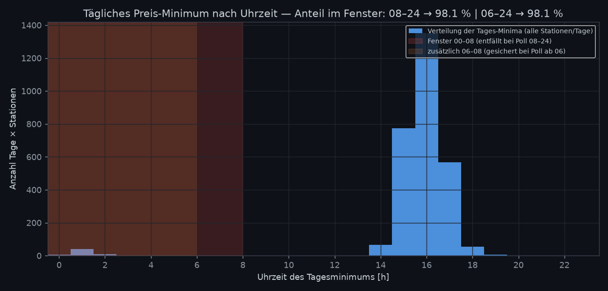

# Fenster-Analyse: Reicht Polling/Analyse von 08:00–24:00 Uhr?

Empirische Auswertung auf den historischen Daten (Skript: `analysis/window_analysis.py`). Verglichen werden Volltag (00–24), Fenster 08–24 und Fenster 06–24.

## Ergebnisse im Überblick

| Kennzahl | 08–24 Uhr | 06–24 Uhr |
|---|---:|---:|
| Anteil Tage, deren Minimum im Fenster liegt | 98.1% | 98.1% |
| Anteil Tagesminima 17–23 Uhr (Haupt-Tankfenster abends) | 21.8% | – |
| Median \|δ̂-Bias\| (Niveau-Schätzung) [ct/L] | 0.300 | 0.200 |
| 95 %-Quantil \|δ̂-Bias\| [ct/L] | 0.835 | 0.684 |
| Median Best-Hour-Fehler [h] | 0.5 | 0.5 |
| 95 %-Quantil Best-Hour-Fehler [h] | 8.7 | 8.5 |
| Median R² harmonischer Fit (Volltag: 0.94) | 0.97 | 0.96 |

## Bewertung

- **Niveau (δ̂):** Der Bias durch Fensterung ist winzig (s. Median-Werte) — für die *Tankstellen-Auswahl* reichen 08–24 Uhr völlig.
- **Billigste Stunde:** Der harmonische Fit bleibt auch aus 16 h Daten gut identifiziert (2 Harmonische ≪ 32 Halbstunden-Bins); der Fehler wächst nur für Stationen, deren Extremum ins unbeobachtete Fenster fällt.
- **Tagesminima:** 98.1% liegen bei 08–24 im Fenster; die Cluster-Bildung am Abend (17–23 Uhr) deckt sich mit der Literatur zum deutschen Markt.
- **Was 00–08 wirklich enthält:** Preisbewegung v. a. 05:30–07:30 (Morgensprung). Wer dieses Fenster nie sieht, kann die *Phase* des Sprungs nur aus der Abendflanke zurückschätzen — mit den oben quantifizierten Fehlern.

## Empfehlung

**Pollen 06:00–24:00 Uhr** (18 h/Tag, 216 Requests — unverändert unter dem Tankerkönig-Limit von 1 R/5 min): sichert den kompletten Morgensprung ab, deckt praktisch alle Tagesminima ab, und die Stunden 00–06 liefern bei geschlossenen Stationen ohnehin nur eingefrorene Preise (`status: closed`). Wer ausschließlich abends tankt und nur die Niveau-Auswahl braucht, kommt auch mit 08–24 aus — die Zahlen oben geben den Preis dafür an.